# Agent-Passport

> Zero standing access for AI agents. Every tool call is checked out, used once, and expires.

A Zero-Standing-Privilege (ZSP) governance and identity middleware for multi-agent systems. Built for the **AI Agents Intensive Vibe Coding Course ('Agents for Business' track)**.

Agent-Passport intercepts and controls agent-to-tool operations using process-level lockdown hooks, ephemeral time-bound credential registries, and a live web-based security command center.

Instead of giving AI agents standing, long-lived access to tools and files, Agent-Passport requires every action to be checked out as a short-lived, single-use token — used once, then gone.

---

## Key Features

1. **Antigravity security hook**: Intercepts direct system/tool invocations at the Node process level, preventing requestor agents from circumventing the passport gateway.
2. **Zero-Standing-Privilege Registry**: Ephemeral token checkout that automatically expires (TTL) or flushes on execution.
3. **Anomaly detection engine**: Gateway filters check payloads for dangerous terminal scripts (`rm -rf`), path traversal, and database injection.
4. **Cinematic security dashboard**: Interactive, mouse-reactive network canvas, glitch kinetic alerts, and a mechanical sliding safety Kill Switch.

---

## System Architecture

```mermaid
graph TD
    A[Requestor Agent] -->|1. Direct Exec Attempt| B(Antigravity Security Hook)
    B -->|2. Intercept & Block| C[Outbound Bypass Alert]
    C -->|3. POST Alarm| D(MCP Gateway Server)
    
    A -->|4. Request Checkout| D
    D -->|5. Evaluate Request| E(Governance Agent)
    E -->|6. Check Policy & Issue TTL| F[(Ephemeral Passport Registry)]
    F -->|7. Return Token| D
    D -->|8. Approve Token & Verify Arguments| A
    
    A -->|9. Execute Tool with Token| D
    D -->|10. Execute Tool| G[System / File / Network Tools]
    D -->|11. Event Broadcasts| H[WebSocket Dashboard UI]
```



---

## Folder Structure

```
agent-passport/
├── frontend/                 # React + Vite Interactive Dashboard
│   ├── src/
│   │   ├── components/
│   │   │   ├── AnimatedKillSwitch.jsx      # Safety cover lock & mechanical push button
│   │   │   ├── InteractiveTopologyGrid.jsx # Mouse-deformable canvas network topology
│   │   │   └── KineticAlerts.jsx            # glitch-style decoder logs ticker
│   │   ├── hooks/
│   │   │   └── useWebSocket.js              # live server synchronization
│   │   ├── App.jsx                          # Main console structure & Simulator Deck
│   │   └── index.css                        # Cyberpunk styling tokens
│   ├── index.html
│   ├── vite.config.js
│   └── package.json
├── backend/                  
│   ├── mcp_server/           # API gateway, WebSocket broadcasting & anomaly engine
│   │   └── server.js
│   ├── agents/
│   │   ├── requestor.js      # Simulation agent script
│   │   └── governance.js     # Role evaluations and path checker
│   ├── antigravity/          # Process runtime hooks
│   │   └── hook.js
│   ├── registry/             # In-memory ephemeral registry
│   │   └── passport.js
│   ├── policies/             # Declarative governance rules (see Roadmap)
│   │   └── policies.yaml
│   ├── package.json
│   └── Dockerfile
├── docker-compose.yml        # Multi-container orchestrator
└── README.md                 # Project Blueprint documentation
```

---

## Setup & Execution

### Option A: Run via Docker (Recommended for Demo Day)

To run the complete system with one command:
```bash
docker-compose up --build
```
Once initialized:
- **Interactive Dashboard**: Access at [http://localhost:5173](http://localhost:5173)
- **MCP Server Gateway**: Active at [http://localhost:4000](http://localhost:4000)

---

### Option B: Local Node.js Development

#### 1. Start the MCP Server Gateway
Navigate to the backend, install libraries, and start the node process:
```bash
cd backend
npm install
npm start
```

#### 2. Start the Vite React Dashboard
Navigate to the frontend, install libraries, and run the hot-reloading development server:
```bash
cd ../frontend
npm install
npm run dev
```
Open [http://localhost:5173](http://localhost:5173) in your browser.

#### 3. Run the CLI Simulation Agent
To run the automated agent scenarios through the terminal:
```bash
cd ../backend
npm run requestor [scenario]
```
Where `[scenario]` is one of:
- `authorized` : Runs a successful, validated tool call.
- `bypass`     : Tries to execute the tool directly. The Antigravity Hook interrupts, terminates the execution, and fires a red bypass alarm.
- `anomaly`    : Attempts to write containing an `rm -rf` payload. Checked and blocked at the Gateway.
- `governance` : Attempts path traversal outside of the workspace directory.

---

## Scenario Telemetry Explanations

1. **Secure Access**: The agent checks out a 5-second Single-Use Token for `read_file`. It validates and executes. The dashboard pulses green.
2. **Bypass Attempt**: The agent tries to execute `read_file` bypassing checkout. The **Antigravity Hook** interrupts, terminates the execution, and fires a red bypass alarm.
3. **Inject Anomaly**: The agent sends command injections (`rm -rf`). The Anomaly engine identifies the destructive pattern and drops the request.
4. **Bad Path**: The agent requests files in system folders (`C:/Windows/...`). Governance checks policies and rejects the checkout.
5. **Kill Switch**: Triggering the mechanical switch flushes all active keys. The network locks down and all requests fail until system reset.

---

## Known Limitations & Roadmap

This is a V1 built for a 5-day capstone — a few things are intentionally simplified for now:

- **Simulation-based, not live-agent-tested.** Currently demoed via scripted CLI scenarios (`requestor.js`). Next step: wire up a real LLM agent or expose the gateway as an actual MCP server so real MCP clients (Claude Desktop, Cursor, etc.) can connect.
- **In-memory registry.** Tokens currently live in a single Node process. Planned: move to Redis (native TTL support via `SETEX`) to support multiple gateway instances and horizontal scaling.
- **Hardcoded governance rules.** Policy logic currently lives in `governance.js`. Planned: move to a declarative `policies.yaml`/`policies.json` file so rules can be defined and extended without touching code.
- **Pattern-matching anomaly detection.** Dangerous payloads are currently caught via string matching (`rm -rf`, path traversal). This is a reasonable V1 but not a hardened threat model. Planned: sandboxed tool execution and allowlist-based validation instead of denylist pattern matching.

---

## About

Zero-Standing-Privilege security layer for AI agents — every tool call is a short-lived, single-use checked-out token instead of standing access. Built for the AI Agents Intensive (Agents for Business track).